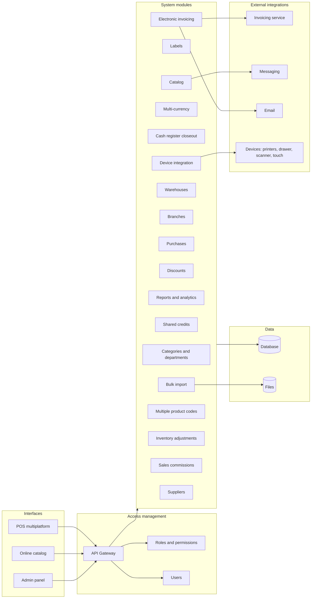

# VibeSale

Web-based POS platform for a local jewelry business.

## Architecture



## Current implementation (Phase 1 foundation)

Implemented today as a working baseline:

- Shared TypeScript contracts for modules, catalog, quoting, currencies, access, and admin overview.
- API endpoints for module map, products, quotes, access snapshot, currencies, and overview metrics.
- React control hub with:
  - module status board,
  - product catalog sample,
  - quote generation form,
  - recent quote list.
- In-memory sample data seeded for jewelry workflows.

## API endpoints

- `GET /api/health`
- `GET /api/message`
- `GET /api/modules`
- `GET /api/currencies`
- `GET /api/access/snapshot`
- `GET /api/catalog/products`
- `GET /api/catalog/quotes`
- `POST /api/catalog/quotes`
- `GET /api/admin/overview`

## Run locally

```bash
npm install
npm run dev
```

- Frontend: `http://localhost:5173`
- Backend: `http://localhost:4000`

## Suggested build order for next phases

1. Access gateway + auth (JWT/session + RBAC enforcement middleware).
2. Inventory core (warehouses, branches, stock movements, adjustments).
3. Sales flow (cart, closeout, discounts, commission assignment).
4. Purchases + suppliers + transfers.
5. Electronic invoicing (CFDI integration adapter).
6. Integrations (messaging, email, hardware bridge, bulk import).
7. Reporting and analytics module with persistent storage.

## Notes

- Data is currently in memory for rapid iteration.
- Next step is introducing persistent storage and migration tooling.
