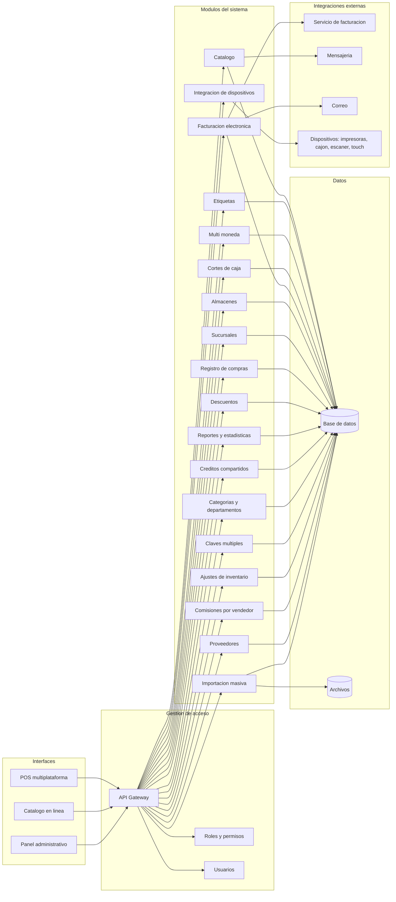

# VibeSale
POS for jewlery store

```mermaid
flowchart LR
  %% Cliente / Punto de venta
  subgraph CLIENTE[Interfaces]
    POS[POS multiplataforma]
    TIENDA[Catalogo en linea]
    ADMIN[Panel administrativo]
  end

  %% API y permisos
  subgraph ACCESO[Gestion de acceso]
    API_GW[API Gateway]
    ROLES[Roles y permisos]
    USERS[Usuarios]
  end

  %% Servicios
  subgraph SERVICIOS[Modulos del sistema]
    CATLG[Catalogo]
    LABELS[Etiquetas]
    DISPO[Integracion de dispositivos]
    MULTI[Multi moneda]
    CAJA[Cortes de caja]
    CFDI[Facturacion electronica]
    ALMACEN[Almacenes]
    SUCUR[Sucursales]
    COMPRAS[Registro de compras]
    DESC[Descuentos]
    REPORT[Reportes y estadisticas]
    CREDIT[Creditos compartidos]
    CATEG[Categorias y departamentos]
    IMPORT[Importacion masiva]
    CLAVES[Claves multiples]
    AJUSTE[Ajustes de inventario]
    VENDED[Comisiones por vendedor]
    PROV[Proveedores]
  end

  %% Datos
  subgraph DATOS[Datos]
    DB[(Base de datos)]
    FILES[(Archivos)]
  end

  %% Externos
  subgraph EXTERNOS[Integraciones externas]
    SAT[Servicio de facturacion]
    MSG[Mensajeria]
    EMAIL[Correo]
    HW[Dispositivos: impresoras, cajon, escaner, touch]
  end

  %% Flujos
  POS --> API_GW
  TIENDA --> API_GW
  ADMIN --> API_GW

  API_GW --> ROLES
  API_GW --> USERS

  API_GW --> CATLG
  API_GW --> LABELS
  API_GW --> DISPO
  API_GW --> MULTI
  API_GW --> CAJA
  API_GW --> CFDI
  API_GW --> ALMACEN
  API_GW --> SUCUR
  API_GW --> COMPRAS
  API_GW --> DESC
  API_GW --> REPORT
  API_GW --> CREDIT
  API_GW --> CATEG
  API_GW --> IMPORT
  API_GW --> CLAVES
  API_GW --> AJUSTE
  API_GW --> VENDED
  API_GW --> PROV

  %% Persistencia
  CATLG --> DB
  LABELS --> DB
  MULTI --> DB
  CAJA --> DB
  CFDI --> DB
  ALMACEN --> DB
  SUCUR --> DB
  COMPRAS --> DB
  DESC --> DB
  REPORT --> DB
  CREDIT --> DB
  CATEG --> DB
  CLAVES --> DB
  AJUSTE --> DB
  VENDED --> DB
  PROV --> DB

  %% Archivos e integraciones
  IMPORT --> FILES
  IMPORT --> DB
  DISPO --> HW
  CFDI --> SAT
  CFDI --> EMAIL
  CATLG --> MSG
```